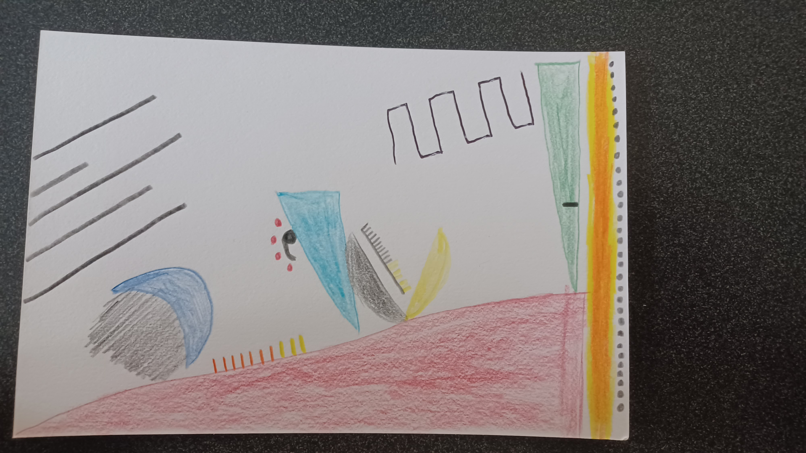

# H1

My name is Cole von Glahn; I am a second year student in the MSCAPP program. I came to CAPP after a career as an artistic producer in the Chicago storefront theater scene. My focus here is on ethical frameworks for big data and human rights in the digital marketplace. Outside of work, I enjoy reading, adventuring in nature, cooking, and playing board games. I'm excited for Data Viz as a former colorblind theater designer to finally make things that don't use purple and blue at the same time!